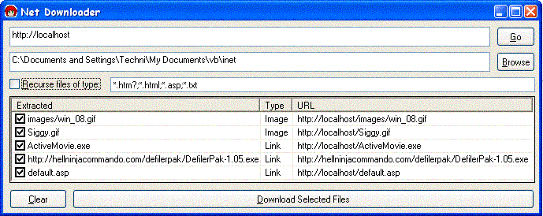



## Net Downloader

### Description

Give it a url to a web page, and it will extract the links to images, scripts and other pages out of it and give you the choice of whether to download them or not

Can now recurse linked files

Huge urls (like links.asp?url=quaz... etc) are cut off at the ?, filenames are forcefully made unique, new downloading method (not inet control) so 4kb bug should be gone
 
### More Info
 

             |
---                |---
**Submitted On**   |2003-06-17 12:17:00
**By**             |[Techni Rei Myoko](https://github.com/Planet-Source-Code/PSCIndex/blob/master/ByAuthor/techni-rei-myoko.md)
**Level**          |Intermediate
**User Rating**    |4.0 (12 globes from 3 users)
**Compatibility**  |VB 6\.0
**Category**       |[Complete Applications](https://github.com/Planet-Source-Code/PSCIndex/blob/master/ByCategory/complete-applications__1-27.md)
**World**          |[Visual Basic](https://github.com/Planet-Source-Code/PSCIndex/blob/master/ByWorld/visual-basic.md)
**Archive File**   |[Net\_Downlo1602176172003\.zip](https://github.com/Planet-Source-Code/techni-rei-myoko-net-downloader__1-42158/archive/master.zip)

